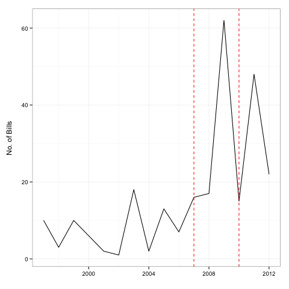

# Comparing Scrutiny Indicators: Bills vs. Hearings

In ''[Creating Scrutiny States]()'' we develop indicators of Congressional scrutiny of the US Federal Reserve. The indicators are created using a change point analysis of indicators of Congresspersons' behavior in relevant committee hearings.

A major alternative approach to measuring Congressional scrutiny of the Federal Reserve is to use counts of proposed legislation that pertain to the Fed (e.g. Kettl 1988 and Binder 2014). Both hearings and bills indicate Congressional scrutiny. However, as Committees and hearings are Congress' primary oversight tool (Oleszek, 2013, 382) and proposed bills need to pass through the committees, data from hearings is a more direct and relevant window onto day-to-day scrutiny. Bill counts also do not capture situations where Congress increases its scrutiny and the Fed makes some response to head off further legislative action.

The following figure compares perhaps the most recent data on yearly counts of proposed bills that pertain to the powers of the Federal Reserve gathered from Binder (2014) (see below for details) with the change points we estimate using data from hearings of the House Committee on Financial Services (HCFS). The two change points in the hearing data were identified to be in April 2007 and June 2010. Before April 2007 was a low scrutiny state. Between April 2007 and May 2010 was a high scrutiny state. The observation period ends with a medium scrutiny state.

### Number of Bills Pertaining to the Fed's Powers Compared to HCFS Hearing Scrutiny States (1997-2012)

Dashed red lines indicate years with a change point in HCFS hearing scrutiny.

There is certainly overlap between the two scrutiny indicators. The high scrutiny state contains the year (2009) with by far the most bills (62). The medium scrutiny state also includes a year with relatively many bills being proposed--48 bills were proposed in 2011.

It is important to note that bill counts appears to provides a lagging indicator of scrutiny. The year with the highest bill counts was a year and a half after congressperson's behavior changed in committee hearings.

## Gathering Data on Bills

Binder's (2014) data was made available in a plot. To gather this data we used the plot scrapper [WebPlotDigitizer ](http://dx.doi.org/10.5281/zenodo.10532). This method may introduce small rounding errors into the data. However, the overall trends in the data are accurately captured by the figure above.

## References

Binder, Sarah. 2014. ''Audit the Fed . . . On Steroids.'' *The Washington Post: Monkey Cage Blog*. <http://www.washingtonpost.com/blogs/monkey-cage/wp/2014/07/08/audit-the-fed-on-steroids/>. Accessed July 2014.

Kettl, Donald. 1988. *Leadership at the Fed*. New Haven: Yale University Press.

Oleszek, Walter J. 2013. *Congressional procedures and the policy process*. London: Sage.
